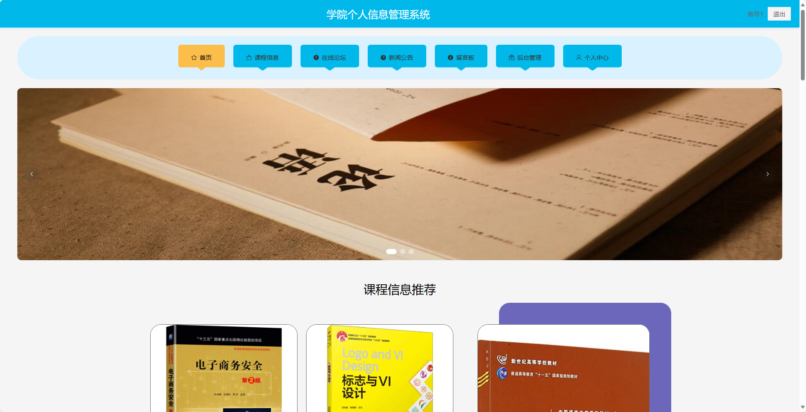
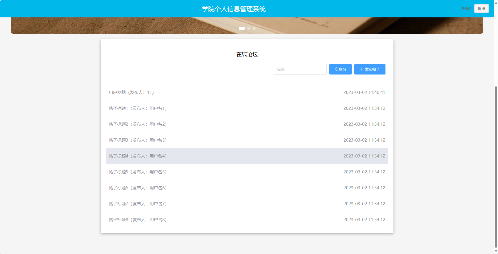
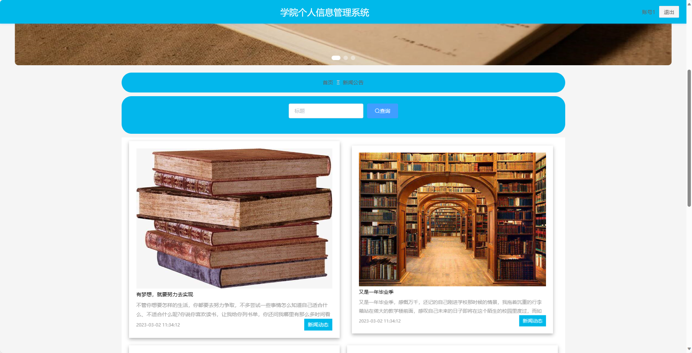
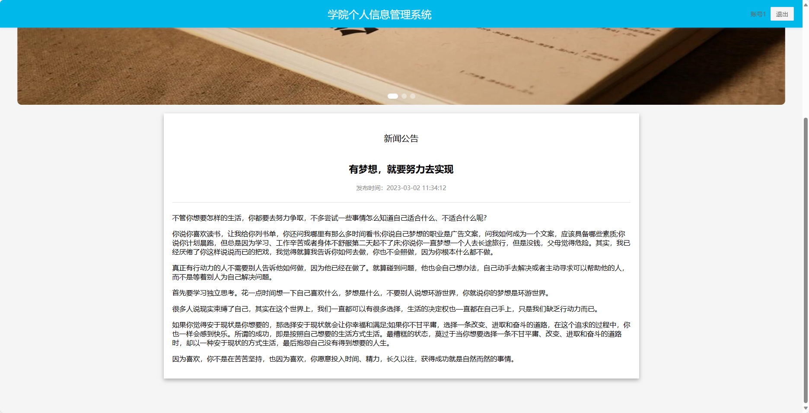
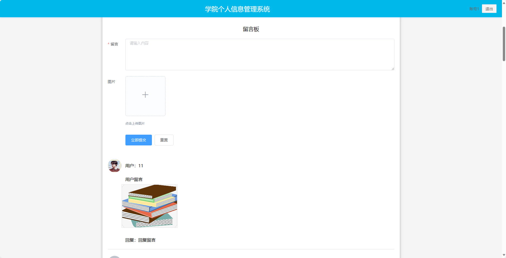
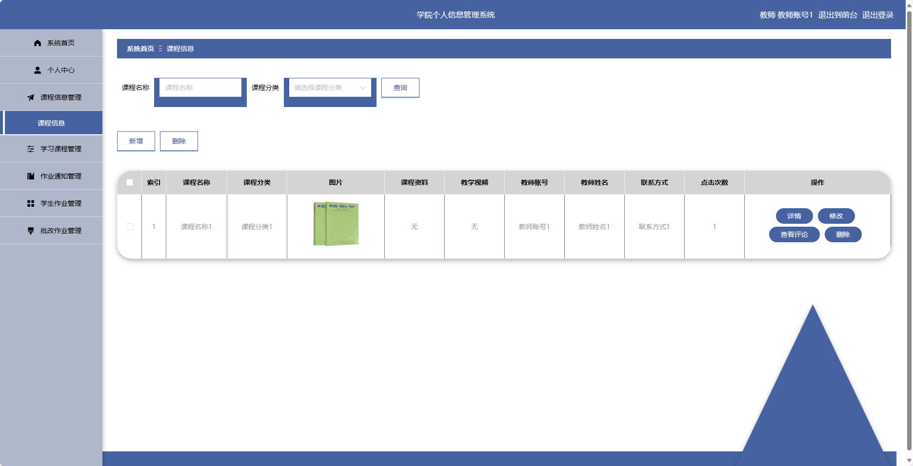
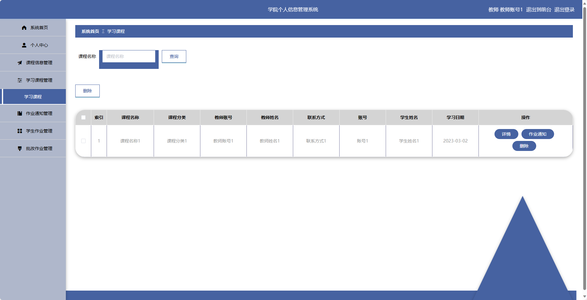
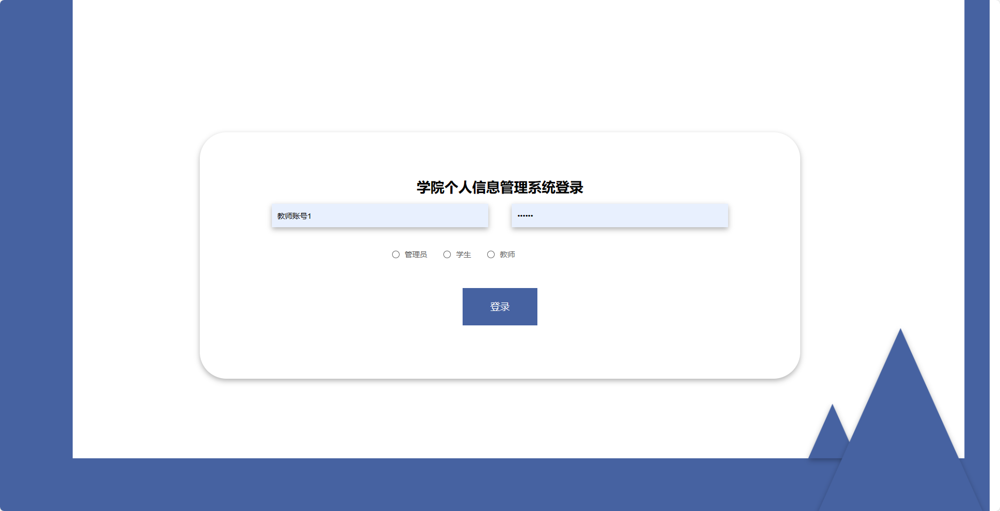
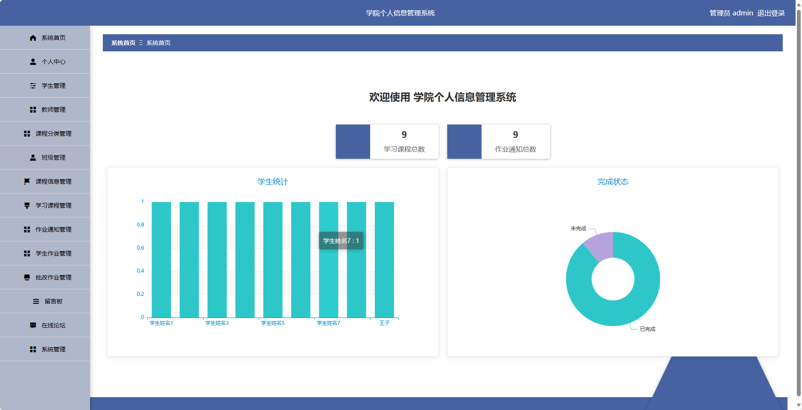

## 基于SpringBoot的学院个人信息管理系统(程序+报告)

###  获取sql数据库文件: 从戎源码网 (https://armycodes.com/) QQ: 386869957 QQ群: 377586148
###  所有系统地址: (https://github.com/YuLin-Coder/AllProjectCatalog) 
###  所有项目以及源代码本人均调试运行无问题 可支持远程安装部署调试、定制修改、代码讲解

## 项目介绍
基于SpringBoot的学院个人信息管理系统，系统包含三种角色：管理员、教师、学生,系统分为前台和后台两大模块，主要功能如下。

### 【管理员】:
- 个人中心：管理员可以管理个人信息，修改密码等。
- 学生管理：管理员可以管理学生的信息，包括添加、编辑和删除学生信息。
- 教师管理：管理员可以管理教师的信息，包括添加、编辑和删除教师信息。
- 课程分类管理：管理员可以管理课程的分类信息，包括添加、编辑和删除课程分类。
- 班级管理：管理员可以管理班级的信息，包括添加、编辑和删除班级。
- 课程信息管理：管理员可以管理课程的详细信息，包括添加、编辑和删除课程。
- 学习课程管理：管理员可以管理学生的学习课程情况，包括记录学习状态和统计学习进度。
- 作业通知管理：管理员可以管理作业的通知信息，包括发布、编辑和删除作业通知。
- 学生作业管理：管理员可以管理学生的作业情况，包括查看和评分学生作业。
- 批改作业管理：管理员可以批改学生的作业，包括评分和给予反馈。
- 留言板：管理员可以管理留言板的帖子和用户，包括编辑、删除帖子和封禁用户。
- 在线论坛：管理员可以管理在线论坛的帖子和用户，包括编辑、删除帖子和封禁用户。
- 系统管理：管理员可以设置平台的基本信息，包括站点名称、联系方式等。

### 教师角色：
- 个人中心：教师可以管理个人信息，修改密码等。
- 课程信息管理：教师可以管理自己负责的课程信息，包括添加、编辑和删除课程信息。
- 学习课程管理：教师可以管理学生的学习课程情况，包括记录学习状态和统计学习进度。
- 作业通知管理：教师可以管理作业的通知信息，包括发布、编辑和删除作业通知。
- 学生作业管理：教师可以管理学生的作业情况，包括查看和评分学生作业。
- 批改作业管理：教师可以批改学生的作业，包括评分和给予反馈。

### 【前台】:
- 首页：展示平台的概述信息、推荐课程等内容。
- 课程信息：用户可以查看、搜索和选择感兴趣的课程。
- 在线论坛：用户可以在论坛上进行交流和讨论。
- 新闻公告：用户可以获取最新的学院相关新闻和公告。
- 留言板：用户可以留言和回复其他用户的留言。
- 后台管理：用户可以登录后台管理系统进行相关管理操作。
- 个人中心：用户可以管理个人信息、查看选课情况等。

## 项目技术
- 编程语言：Java
- 数据库：MySQL
- 项目管理工具：Maven
- 前端技术：HTML、CSS、JavaScript、Jquery、Vue
- 后端技术：Spring、SpringMVC、MyBatis

## 运行环境
- JDK版本：JDK1.8及以上
- 开发工具：IDEA、Ecplise、Myecplise都可以
- 数据库: MySQL5.7及以上
- Maven：maven3.0及以上
- Node：14.14.0及以上

## 运行截图

